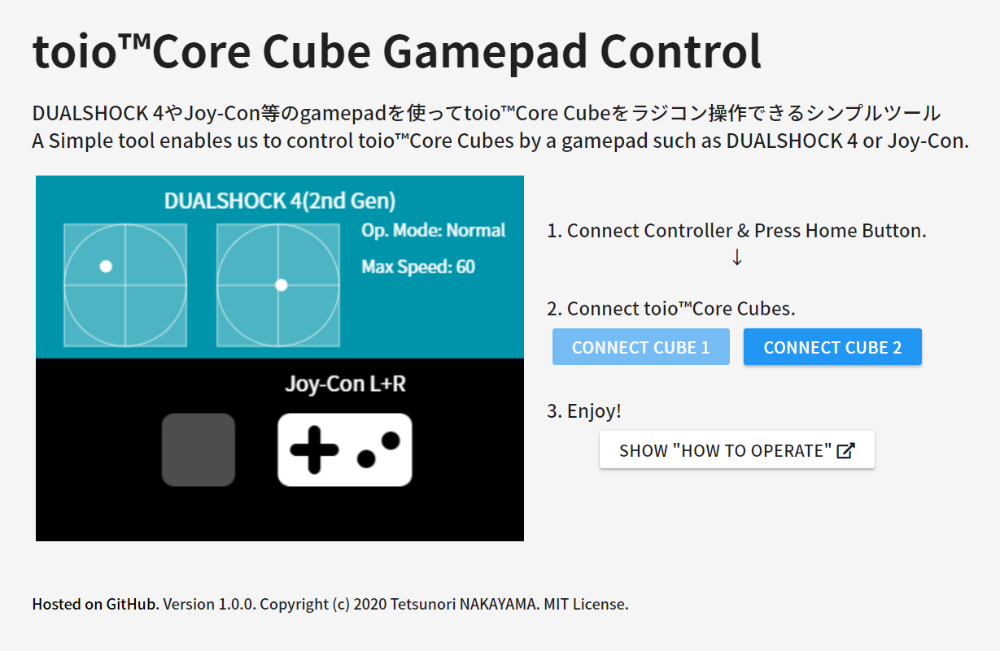
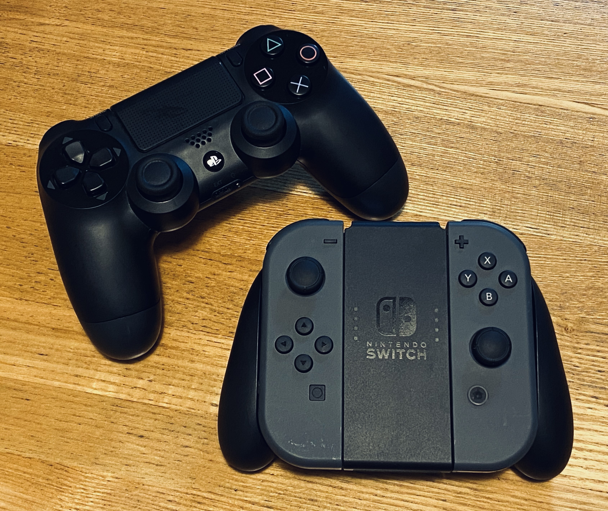
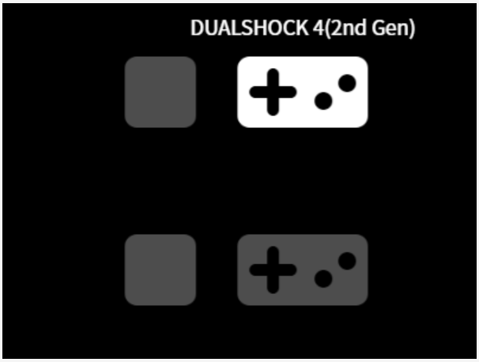
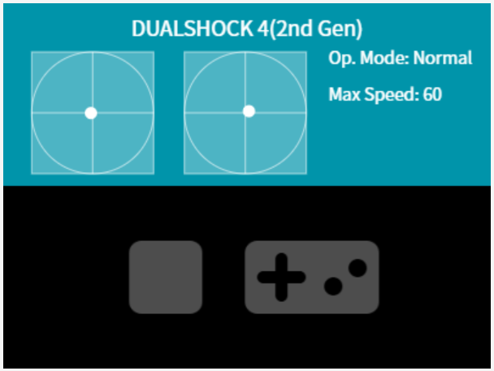
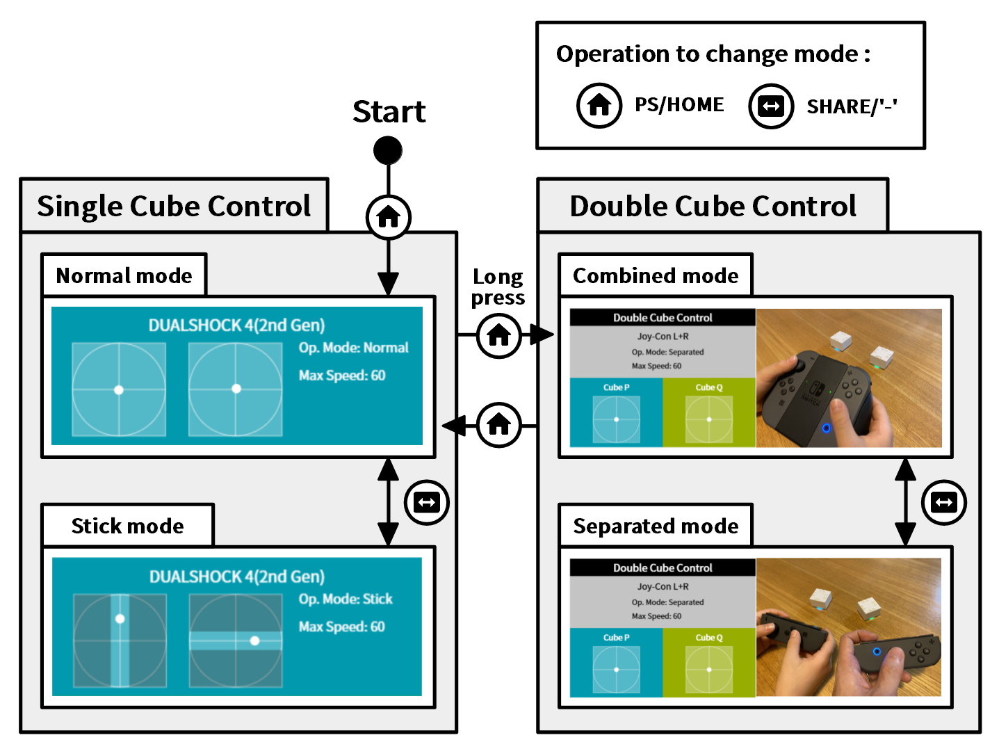

# toio™Core Cube Gamepad Control
Version 1.0.0  

# Description
A Simple tool enables us to control toio™Core Cubes by a gamepad such as DUALSHOCK 4 or Joy-Con.  
See [this article(Under Construction)](https://qiita.com/tetunori_lego/items/37477c40b16f8eab384f) in detail. You can try [here](https://tetunori.github.io/toioCoreCubeGampadControl/).  
Now, WebBluetooth works on the limited browser/OS. Please check the support status on [Can I Use](https://caniuse.com/#feat=web-bluetooth).

# Usage
## Preparation
### Hardware
1. Turn the Cubes on.
2. Prepare some gamepads as DUALSHOCK 4 or Joy-Con(L&R), then pair the gamepad and PC beforehand. 

### Software
1. Open [this tool](https://tetunori.github.io/toioCoreCubeGampadControl/). Google Chrome is highly recommended.
2. Push the PS/Home button on the gamepad. You will see the gamepad icon active in the canvas. 
3. Automatically, the dialog for Bluetooth connection will open. Or by pressing "Connect Cube 1/2" button, you can open the dialog manually. Then, you can select and connect Cubes one by one.
4. If the tool is ready, the canvas will show the image like below. 

## Mode Description
We have some modes to control cubes. Please see the chart below.
 

- Single Cube Control
  - Normal mode
    - Left analog stick: Move
    - Right analog stick(X-Axis): Rotation
  - Stick mode
    - Left analog stick(Y-Axis): Speed
    - Right analog stick(X-Axis): Direction
- Double Cube Control
  - Combined mode
    - 
    - Left analog stick: Cube1 Move
    - Right analog stick: Cube2 Move
  - Separated mode
    - Mainly, for Joy-Con L/R 
    - Left analog stick(rotate 90 deg.): Cube1 Move
    - Right analog stick(rotate -90 deg.): Cube2 Move

## Screen Description

### Single Cube Control

### Double Cube Control

## Operation
### Common
|Category|Gamepad Op. DUALSHOCK 4/Joy-Con|Screen/UI Example|
|---|---|---|
|Exchange Cube1/2|OPTION/+ button|Light Cube1 in blue, Cube2 in green.|
|Reset setting|PS/HOME button| - |
|Adjust speed|L1/R1, L/R button| Default value is 60.|

### Single Cube Control
#### Common
|Category|Gamepad Op. DUALSHOCK 4/Joy-Con|Screen/UI Example|
|---|---|---|
|Register gamepad|PS/Home button|If not registered|
|Switch gamepad1/2|PS/Home button|If registered|
|Switch op. mode|SHARE/- button|Toggle Normal<->Stick|
|Transit to Double Cube Control|Long-press PS/Home button| - |

#### Normal mode
|Category|Gamepad Op. DUALSHOCK 4/Joy-Con|Screen/UI Example|
|---|---|---|
|Analog move|Left analog stick||
|Go forward/backward|UP/DOWN button|top speed|
|Turn|X-axis of right analog stick or LEFT/RIGHT button|Also CIRCLE/A, SQUARE/Y button used as top speed turn|
Working demo movie(will update...)

#### Stick mode
|Category|Gamepad Op. DUALSHOCK 4/Joy-Con|Screen/UI Example|
|---|---|---|
|Speed control|Y-axis of left analog stick or left/right trigger|Also UP/DOWN button used as top speed|
|Direction control|X-axis of right analog stick|Also CIRCLE/A, SQUARE/Y button used as max value|
Working demo movie(will update...)

### Double Cube Control
#### Common
|Category|Gamepad Op. DUALSHOCK 4/Joy-Con|Screen/UI Example|
|---|---|---|
|Switch op. mode|SHARE/- button|Toggle Combined<->Separated|
|Transit to Single Cube Control|PS/Home button| - |

#### Combined mode
|Category|Gamepad Op. DUALSHOCK 4/Joy-Con|Screen/UI Example|
|---|---|---|
|Cube1 Analog move|Left analog stick||
|Cube1 forward/backward|UP/DOWN button|top speed|
|Cube1 Turn|LEFT/RIGHT button|top speed turn|
|Cube2 Analog move|Right analog stick||
|Cube2 forward/backward|TRIANGLE/CROSS button|top speed|
|Cube2 Turn|SQUARE/CIRCLE button|top speed turn|
Working demo movie(will update...)

#### Separated mode
|Category|Gamepad Op. DUALSHOCK 4/Joy-Con|Screen/UI Example|
|---|---|---|
|Cube1 Analog move|Left analog stick (rotate 90 deg.)||
|Cube1 forward/backward|LEFT/RIGHT button|top speed|
|Cube1 Turn|UP/DOWN button|top speed turn|
|Cube2 Analog move|Right analog stick (rotate -90 deg.)||
|Cube2 forward/backward|SQUARE/CIRCLE button|top speed|
|Cube2 Turn|TRIANGLE/CROSS button|top speed turn|
Working demo movie(will update...)

# Licence
This software is released under the MIT License, see LICENSE.

# Author
Tetsunori NAKAYAMA.

# References
toio™  
https://toio.io/

toio™Core Cube Specification  
https://toio.github.io/toio-spec/

HTML5 Gamepad Specification  
https://www.w3.org/TR/gamepad/

HTML5 Gamepad Tester  
https://html5gamepad.com/  

Icon  
https://material.io/resources/icons/

UI parts  
https://www.muicss.com/
